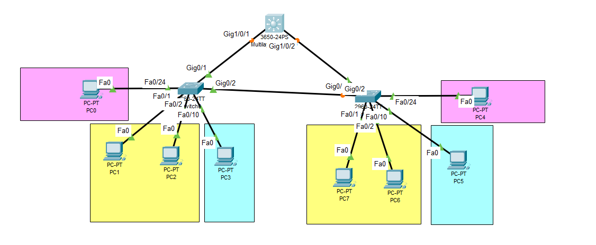

# 🔐Secure Campus Network Architecture Lab

## 📌 Overview
This repository contains a Cisco Packet Tracer laboratory demonstrating a secure, segmented campus network. The primary objective of this project is to implement robust Layer 2 and Layer 3 security controls to mitigate common Local Area Network (LAN) attacks, such as VLAN hopping, MAC flooding, DHCP starvation, and Spanning Tree manipulation.

This lab serves as a practical demonstration of secure network design principles and defensive configurations required in modern enterprise environments.

## 🏗️ Network Topology

The network utilizes a classic hierarchical design:
* **Core/Distribution Layer:** 1x Cisco 3650 Multilayer Switch
* **Access Layer:** 2x Cisco 2960 Switches
* **Endpoints:** Segmented user workstations across multiple broadcast domains.

## 🛡️ Key Security Features & Technologies Implemented

### 1. Layer 3 Switching & Segmentation
* **Inter-VLAN Routing:** Configured Switched Virtual Interfaces (SVIs) on the Multilayer Switch to handle routing between segmented departments without needing a "router on a stick."
* **VLAN Isolation:** Endpoints are strictly grouped into distinct VLANs (e.g., VLAN 10, VLAN 20, VLAN 99) to enforce logical boundaries and reduce the attack surface.

### 2. Trunking Security
* **Static Trunking:** Uplinks between switches are manually hardcoded as trunks.
* **DTP Disabled:** Dynamic Trunking Protocol (DTP) negotiation is administratively disabled (`switchport nonegotiate`) to prevent VLAN hopping attacks via rogue device negotiation.

### 3. Port Security & Physical Access Control
* **Unused Port Mitigation:** All inactive switch ports are administratively shut down to prevent unauthorized physical access.
* **MAC Address Restriction:** Active access ports are limited to a maximum of 4 MAC addresses to prevent MAC flooding/CAM table exhaustion attacks.
* **Static & Sticky Binding:** Endpoint MAC addresses are bound to their respective switch ports.
* **Violation Restrict Mode:** Unauthorized devices trigger dropped packets and generate a Syslog alert, ensuring security without completely disabling the port for legitimate users.

### 4. DHCP Snooping
* **Trust Boundaries:** Only the uplink port pointing to the legitimate DHCP server is configured as trusted.
* **Rate Limiting:** Untrusted access ports are limited to 5 DHCP packets per second to successfully mitigate DHCP starvation and rogue DHCP server (Man-in-the-Middle) attacks.

### 5. Spanning Tree Protocol (STP) Hardening
* **Rapid PVST+:** Upgraded from standard STP to Rapid Per-VLAN Spanning Tree for faster convergence.
* **Root Bridge Protection:** The Multilayer switch is statically elected as the primary Root Bridge to ensure optimal traffic flow and prevent rogue switches from taking over the STP topology.
* **Edge Security:** `PortFast` and `BPDU Guard` are enabled on all user-facing access ports. If an attacker attempts to plug in a rogue switch and broadcast BPDUs, the port immediately enters an `err-disable` state.

## 🚀 How to Use This Lab

### Prerequisites
* [Cisco Packet Tracer](https://www.netacad.com/courses/packet-tracer) (Version 8.0 or higher recommended)

### Instructions
1. Clone this repository to your local machine.
2. Open the `.pkt` file using Cisco Packet Tracer.
3. Access the CLI of any switch to review the running configurations.

### Useful Verification Commands
To verify the security postures implemented in this lab, use the following commands in the switch CLIs:
```text
show port-security
show ip dhcp snooping
show interfaces trunk
show spanning-tree
show ip interface brief
